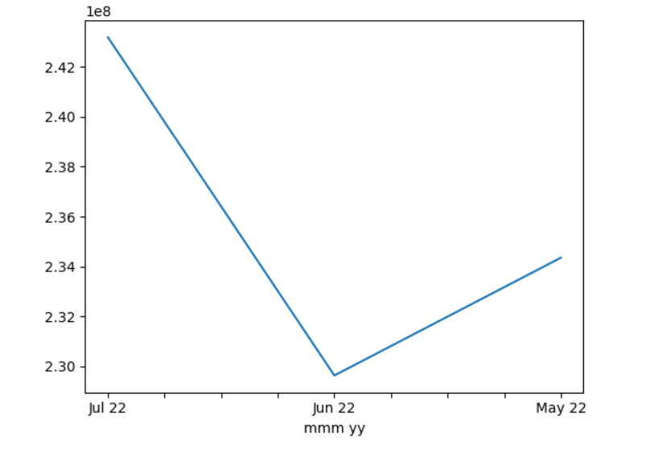
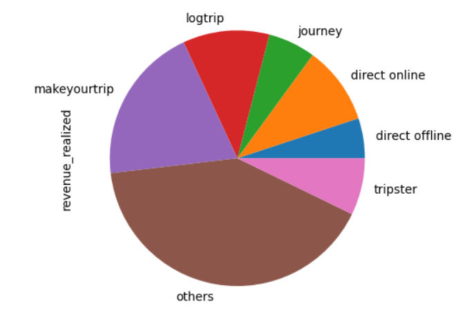
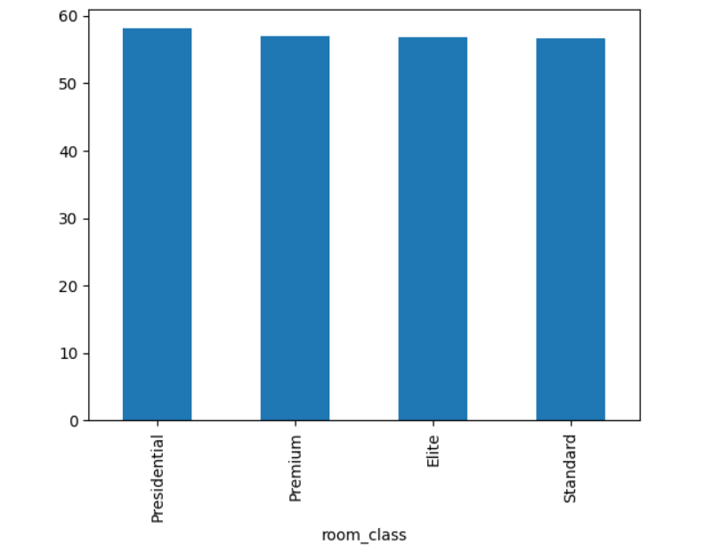
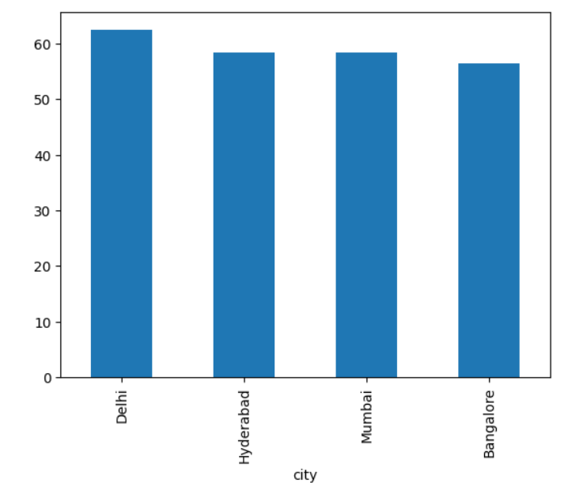
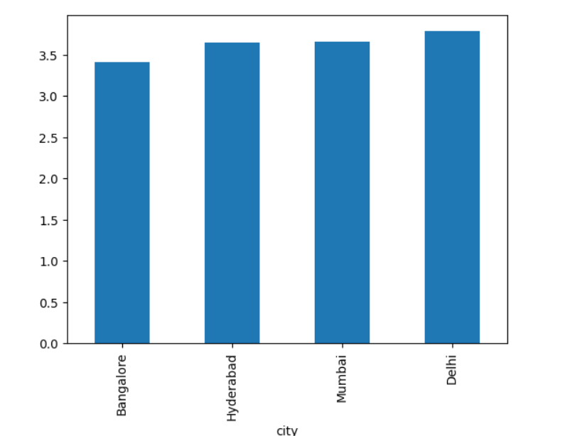

# AtliQ Grands Data Analysis Using Python

## Table of Contents
- [Project Overview](#project-overview)
- [Problem Statement](#problem-statement)
- [Key Insights](#key-insights)
- [Recommendations](#recommendations)
- [Visualizations](#visualizations)
- [Tools Used](#tools-used)
- [How to Use](#how-to-use)
- [Next Steps](#next-steps)
- [Acknowledgements](#acknowledgements)

  
## Project Overview
AtliQ Grands is a fictional hotel chain facing challenges from competitors, resulting in declining revenue and market share. This project analyzes booking data to identify actionable strategies for improving performance.

## Problem Statement
AtliQ Grands operates across Delhi, Mumbai, Hyderabad, and Bangalore, with multiple hotel categories (e.g., luxury, budget). Booking data from various channels (e.g., website, third-party platforms) was analyzed to:
1. Understand booking patterns.
2. Identify revenue and occupancy trends.
3. Provide recommendations for business improvement.

## Key Insights

### 1. Revenue Trends
- **Highest Revenue**: AtliQ Exotica (₹320.26 million).
- **Lowest Revenue**: AtliQ Seasons (₹66.08 million).
- **Monthly Revenue**:
  - May 2022: ₹408.37 million
  - June 2022: ₹377.19 million
  - July 2022: ₹389.94 million
- **Visual**:
  
  

### 2. Booking Platform Performance
- **Top Contributors**:
  - Third-party platforms like "MakeMyTrip" and "LogTrip" dominate bookings.
- **Direct Bookings**:
  - Contribute less, increasing dependence on third-party platforms.
- **Visual**:
  
  

### 3. Occupancy Rates
- **Room Type**:
  - Presidential Suites have the highest occupancy rate (59.28%).
  - Standard Rooms have the lowest (57.89%).
- **City-Wise**:
  - Highest Occupancy: Delhi (62.47%)
  - Lowest Occupancy: Bangalore (56.44%)
- **Weekday vs. Weekend**:
  - Weekends: 72.34%
  - Weekdays: 50.88%
- **Visuals**:
     - Occupancy Rates by Room Type
        
   
    
     - Occupancy Rates by City
    
   

### 4. Customer Ratings
- **Top-Rated City**: Delhi (3.78 average rating).
- **Lowest-Rated City**: Bangalore (3.41 average rating).
- **Visual**:
  
  

### 5. Operational Challenges
- **Overbooking**:
  - Standard Rooms and Presidential Suites are overbooked during peak periods.
- **Capacity Breaches**:
  - E.g., AtliQ Palace faced overbookings on several occasions.

## Recommendations

1. **Optimize Revenue**:
   - Focus marketing on low-performing properties (e.g., AtliQ Seasons).
   - Introduce weekday-specific discounts in Bangalore to boost weekday occupancy.

2. **Reduce Third-Party Dependence**:
   - Incentivize direct bookings with loyalty programs and discounts.
   - Develop a user-friendly direct booking platform.

3. **Improve Occupancy**:
   - Launch corporate packages targeting business travelers during weekdays.
   - Promote Presidential Suites with luxury packages.
   - Introduce early-bird discounts and group bookings for weekdays.
   - Collaborate with local event organizers to host VIP stays.

4. **Enhance Customer Experience**:
   - Address customer concerns in Bangalore through targeted feedback collection.
   - Train staff to deliver consistent service across all properties.

5. **Manage Overbooking**:
   - Implement predictive analytics to anticipate peak demand.
   - Introduce dynamic room allocation to prevent capacity breaches.

## Visualizations
All visualizations are available in the `visuals/` folder:
- `monthly_revenue_trends.png`
- `revenue_by_platform.png`
- `occupancy_by_room_type.png`
- `occupancy_by_city.png`
- `customer_ratings_by_city.png`

## Tools Used
- **Python (Pandas, Matplotlib)**: For data cleaning and analysis.
- **Jupyter Notebook**: For interactive data exploration and visualization.

## How to Use
1. **Data**:
   - The `data/` folder contains datasets and descriptions.
2. **Visualizations**:
   - Refer to the `visuals/` folder for all charts.
3. **Analysis**:
   - Review the Jupyter Notebook in the repository for step-by-step analysis.

## Next Steps
- Extend the analysis by incorporating external data such as competitor pricing or customer demographics.
- Use Power BI or Tableau to build an interactive dashboard for stakeholders.

## Acknowledgements
- This project is based on anonymized data provided for educational purposes.
 
